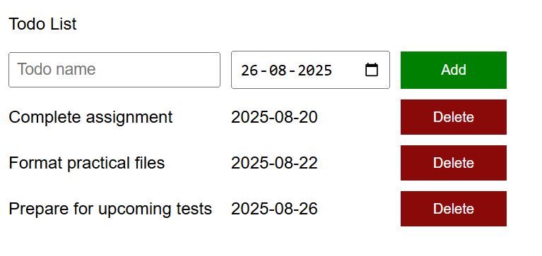

# 📝 To-Do List App

A simple **To-Do List application** built with **HTML, CSS, and JavaScript**.  
Users can add tasks with due dates, view them in a clean grid layout, and delete tasks when completed.  
All tasks are stored in **localStorage** for persistence across sessions.  

---

## 🚀 Features
- ➕ Add new tasks with a title and due date  
- ❌ Delete tasks individually  
- 💾 Persistent storage using **localStorage** (tasks remain after refresh)  
- 🖥️ Responsive grid layout  

---

## 🛠️ Tech Stack
- **HTML5**  
- **CSS3** (Grid layout & button styling)  
- **JavaScript (ES6)** — DOM manipulation, localStorage, and event handling  

---

## 📂 Project Structure
```
todo-list-app/
├── index.html
├── style.css
├── script.js
├── images
    ├── screenshot.png
```

---

## 📸 Preview
<p align="center">
  
</p>

---

## ▶️ Live Demo
Once deployed with GitHub Pages, your app will be available here:  
👉 **https://Krtyaka.github.io/todo-list-app/**

---

## ⚡ How to Run Locally
1. Clone this repository:
   ```bash
   git clone https://github.com/Krtyaka/todo-list-app.git
